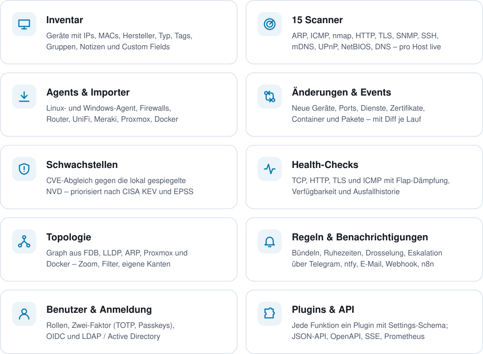
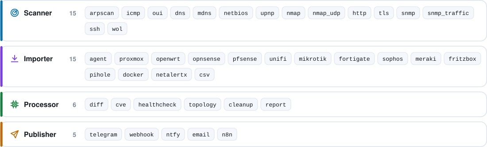
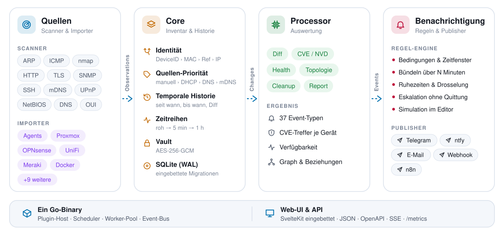

<p align="center">
  <picture>
    <source media="(prefers-color-scheme: dark)" srcset="docs/assets/banner-de-dark.svg">
    
  </picture>
</p>

<p align="center">
  <a href="#schnellstart"></a>
  
  
  
  <a href="#plugins"></a>
  
</p>

<p align="center">
  <b>Was ist das, wo hängt es, was läuft darauf, seit wann, was hat sich geändert,<br>
  ist es erreichbar, ist es verwundbar?</b><br>
  NetScope beantwortet das für jedes Gerät im Netz – selbst gehostet, als ein einziges Binary.
</p>

<p align="center">
  <a href="README.md">English</a> · <b>Deutsch</b>
</p>

## Funktionen

<picture>
  <source media="(prefers-color-scheme: dark)" srcset="docs/assets/features-de-dark.svg">
  
</picture>

- **Inventar** jedes Geräts: Adressen, Hersteller, Typ, Tags, Gruppen, Custom Fields, Notizen,
  Eltern/Kinder (Host ↔ VM ↔ Container, Switch ↔ Port) und die vollständige Änderungshistorie.
- **Erkennung** über ARP, ICMP, nmap (Dienste, Versionen, OS), DNS, mDNS, NetBIOS, UPnP, HTTP,
  TLS, SNMP (inklusive Traffic je Switch-Port) und SSH.
- **Importe** aus Proxmox, OPNsense, pfSense, UniFi, MikroTik, FortiGate, Sophos, Meraki,
  FRITZ!Box, Pi-hole, OpenWrt, Docker, NetAlertX und CSV.
- **Agent für Linux und Windows:** Inventar und Auslastung ohne SSH-Zugang, auch hinter NAT;
  er aktualisiert sich selbst.
- **Schwachstellen:** CVE-Abgleich gegen eine lokal gespiegelte NVD, priorisiert nach CISA KEV
  und EPSS.
- **Überwachung:** Änderungs-Events, Health-Checks, Topologie-Graph und Berichte.
- **Racks:** Geräte und Patchfelder in Racks (auch halbe und drittel Breite), Switch-Ports aus
  SNMP mit erkannten Geräten, Zuordnung per Klick und Patchkabel bis zur Dose.
- **Benachrichtigungen:** Regeln mit Bündelung, Ruhezeiten, Drosselung und Eskalation über
  Telegram, ntfy, E-Mail, Webhook und n8n.
- **Entfernte Netze und Standorte:** eigene WireGuard-Tunnel oder je Standort eine
  NetScope-Instanz, die an eine Zentrale liefert.
- **Benutzer:** Rollen, Zwei-Faktor-Anmeldung (TOTP, Passkeys), OIDC und LDAP / Active Directory.
- **Oberfläche auf Deutsch und Englisch**, je Benutzer wählbar.

## Schnellstart

NetScope läuft als Container mit Host-Netzwerk (ARP, mDNS, SSDP und Wake-on-LAN brauchen
direkten Zugang zum LAN):

```yaml
# docker-compose.yml
services:
  netscope:
    image: netscope:latest
    build: .
    container_name: netscope
    network_mode: host
    cap_add: [NET_RAW, NET_ADMIN]
    volumes:
      - ./data:/data
    environment:
      TZ: Europe/Berlin
      NETSCOPE_LISTEN: ":8080"
    restart: unless-stopped
```

```bash
git clone <repo> netscope && cd netscope
make docker-up                      # baut das Image und startet den Container
cat data/setup-code.txt             # Einrichtungscode (steht auch im Log)
```

`http://<host>:8080` öffnen und den Einrichtungscode eingeben. Der Assistent fragt Sprache und
Zeitzone, das Administrator-Konto, die Rolle (allein, Zentrale oder Standort), die zu
scannenden Netze, die Scanner und optional Router, Controller und Server mit Zugangsdaten ab –
bis zum Abschluss läuft kein Plugin ([Erster Start](docs/GUIDE.md#erster-start)). Mit
`NETSCOPE_ADMIN_PASSWORD` entfällt der Assistent (automatisierte Installationen).

> **Master-Key sichern.** Zugangsdaten sind mit `data/master.key` verschlüsselt; ohne ihn sind
> gespeicherte Passwörter und Tokens verloren. Alternativ per `NETSCOPE_MASTER_KEY` übergeben.

**Hinter einem Reverse-Proxy** (Traefik, Caddy, nginx): NetScope spricht reines HTTP; die
öffentliche URL unter **System → Einstellungen** eintragen. Verlangt der Proxy eine Anmeldung
(Pangolin, Authentik …), müssen Agents, Standorte und Prometheus daran vorbei – siehe
[Handbuch](docs/GUIDE.md#hinter-einem-reverse-proxy-traefik).

Eingestellt wird alles in der Oberfläche. Nur wenige Startwerte (Adresse, Datenverzeichnis,
Log-Level, erstes Admin-Passwort, Zeitzone beim ersten Start) kommen aus `/data/config.yaml` oder
Umgebungsvariablen – [vollständige Liste](docs/GUIDE.md#konfiguration).

## Agents

Unter **Agents → Agent installieren** erzeugt NetScope einen Installationsbefehl:

```bash
# Linux, als root
curl -fsSL http://netscope.lan:8080/agent/install.sh | sudo sh -s -- --token nse_…
```

```powershell
# Windows, PowerShell als Administrator
& ([scriptblock]::Create((irm 'http://netscope.lan:8080/agent/install.ps1'))) -Token nse_…
```

Der Agent läuft ohne Administratorrechte, liest nur und verbindet sich nur nach außen. Details
im [Handbuch](docs/GUIDE.md#netscope-agent).

## Plugins

<picture>
  <source media="(prefers-color-scheme: dark)" srcset="docs/assets/plugins-de-dark.svg">
  
</picture>

Jedes Plugin wird in der Oberfläche eingerichtet: an/aus, Zeitplan, Einstellungen, Scope
(Subnetze, Gruppen, Tags, Geräte, Filter), Timeout, Wiederholungen und Laufhistorie. Änderungen
wirken sofort. Alle Plugins mit Standard-Zeitplan stehen im [Handbuch](docs/GUIDE.md#plugins).

## Funktionsweise

<picture>
  <source media="(prefers-color-scheme: dark)" srcset="docs/assets/architecture-de-dark.svg">
  
</picture>

Scanner, Importer und Agents melden, was sie sehen. Der Core ordnet jede Meldung einem Gerät
zu, führt die Historie und leitet Änderungen ab; Processor machen daraus Events, und die
Regel-Engine entscheidet, wer benachrichtigt wird. Details in
[docs/ARCHITECTURE.md](docs/ARCHITECTURE.md).

## Dokumentation

| Dokument | Inhalt |
|---|---|
| [docs/GUIDE.md](docs/GUIDE.md) | Handbuch: Konfiguration, Plugins, Zugangsdaten, Agents, WireGuard, mehrere Standorte, Filtersprache, Regeln, Schwachstellen, Benutzer und Anmeldung, Sprachen, API, Backup, Sicherheit |
| [docs/ARCHITECTURE.md](docs/ARCHITECTURE.md) | Aufbau, Datenmodell, Plugin-Schnittstellen, Event-Katalog, API |
| [docs/PLUGINS.md](docs/PLUGINS.md) | Eigene Plugins entwickeln |
| [docs/PUBLISHERS.md](docs/PUBLISHERS.md) | Telegram, ntfy, E-Mail, Webhook und n8n |
| [docs/FRONTEND.md](docs/FRONTEND.md) | Weboberfläche: Komponenten, API-Client, Konventionen |

Die API ist in der laufenden Instanz unter `/api/docs` dokumentiert (OpenAPI:
`/api/openapi.json`).

## Entwicklung

| Befehl | Zweck |
|---|---|
| `make build` | Frontend bauen und in das Binary einbetten (`bin/netscope`) |
| `make dev` | Go-Backend auf :18080 und Vite-Dev-Server auf :5173 mit Hot Reload |
| `make test` | Unit-Tests, danach die Performance-Ziele |
| `make lint` | gofmt, go vet, golangci-lint, Prettier, svelte-check |
| `make docker-up` / `docker-down` | Container bauen und starten / stoppen |
| `make smoke` | End-to-End-Test gegen eine laufende Instanz |
| `make notices` | `THIRD_PARTY_NOTICES.md` nach Änderungen an Abhängigkeiten neu erzeugen |

Ohne lokales Go/Node laufen `make build/test/lint` in Docker. Die Grafiken dieser README
erzeugt `node scripts/readme-assets.mjs`.

## Lizenz

NetScope ist proprietäre Software, © 2026 Clusterzx, alle Rechte vorbehalten – siehe
[LICENSE](LICENSE). Nutzung nur mit einer gesonderten schriftlichen Lizenzvereinbarung.

Enthaltene Komponenten Dritter stehen unter ihren eigenen Lizenzen
([THIRD_PARTY_NOTICES.md](THIRD_PARTY_NOTICES.md); im Image unter `/usr/share/doc/netscope/`).
Wichtig für den Vertrieb: Das Image enthält **nmap**, dessen Lizenz (NPSL) eine
**Nmap-OEM-Lizenz** verlangt, wenn nmap zusammen mit einem proprietären Produkt weitergegeben
wird.
