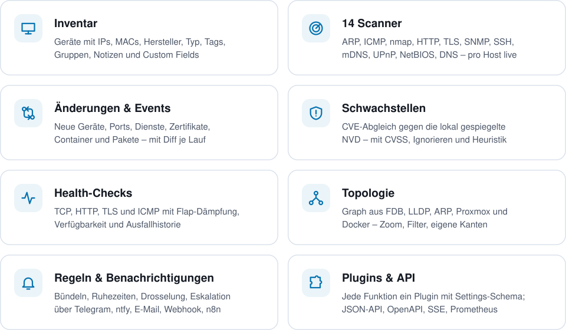
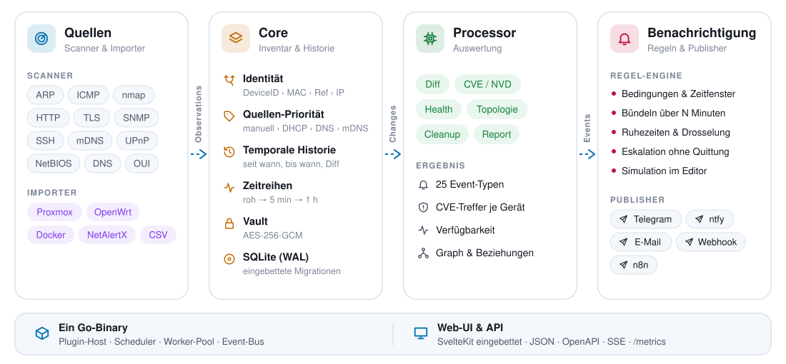
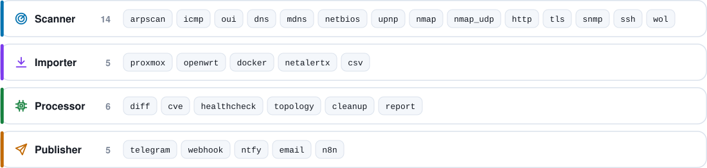

<p align="center">
  <picture>
    <source media="(prefers-color-scheme: dark)" srcset="docs/assets/banner-dark.svg">
    
  </picture>
</p>

<p align="center">
  <a href="#schnellstart"></a>
  
  
  
  <a href="#plugins"></a>
  
</p>

<p align="center">
  <b>Was ist das, wo hängt es, was läuft darauf, seit wann, was hat sich geändert,<br>
  ist es erreichbar, ist es verwundbar?</b><br>
  NetScope beantwortet das für jedes Gerät im Netz – selbst gehostet, als ein einziges Binary.
</p>

<p align="center">
  <a href="#schnellstart">Schnellstart</a> ·
  <a href="#funktionen">Funktionen</a> ·
  <a href="#architektur">Architektur</a> ·
  <a href="#plugins">Plugins</a> ·
  <a href="#filter-query-sprache">Filter</a> ·
  <a href="#dokumentation">Dokumentation</a>
</p>

## Funktionen

<picture>
  <source media="(prefers-color-scheme: dark)" srcset="docs/assets/features-dark.svg">
  
</picture>

<details>
<summary><b>Alle Funktionen im Detail</b></summary>
<br>

- **Inventar:** Geräte mit IPs, MACs, Hersteller, Hostname (aus Quellen mit Priorität), Typ,
  Aufstellort, Besitzer, Tags, Gruppen, Custom Fields, Notizen (Markdown), Eltern/Kinder
  (Host ↔ VM, Host ↔ Container, Switch ↔ Port), Merge/Split, vollständiges Audit-Log.
- **Scanner:** ARP, ICMP (Latenz/Verlust als Zeitreihe), nmap TCP/UDP (Dienste, Versionen, OS,
  CPE), DNS, mDNS, NetBIOS, UPnP, OUI, HTTP (Titel, Server, Favicon-Hash, Web-App-Erkennung),
  TLS (Zertifikate, schwache Protokolle/Cipher), SNMP (inkl. FDB/LLDP), SSH-Inventar
  (Pakete, Dienste, Sockets, Docker), Wake-on-LAN.
- **Importer:** Proxmox VE, OpenWrt/GL.iNet (DHCP), Docker, NetAlertX, CSV.
- **Entfernte Netze:** Subnetze hinter Routern oder über einen eigenen WireGuard-Tunnel von
  NetScope (z. B. ins Rechenzentrum) – Konfiguration hochladen, fertig.
- **Mehrere Standorte:** In jedem Netz eine eigene NetScope-Instanz, die an eine Zentrale
  liefert; dort alle Netze gemeinsam oder je Standort, mit Standort-Auswahl, Filter und Regeln.
- **Auswertung:** Änderungserkennung mit Events, CVE-Abgleich gegen eine lokal gespiegelte
  NVD, Health-Checks mit Verfügbarkeit, Topologie-Graph, Berichte.
- **Benachrichtigungen:** Regel-Engine (Bedingungen, Bündelung, Ruhezeiten, Drosselung,
  Eskalation) mit Telegram, Webhook, ntfy, E-Mail und n8n.
- **Technik:** ein Go-Binary ohne CGO, SQLite (WAL), eingebettete SvelteKit-Oberfläche
  (Dark Mode), JSON-API mit OpenAPI, Live-Updates per SSE, Prometheus-Metriken.

</details>

## Schnellstart

NetScope läuft als Container mit Host-Netzwerk (ARP, mDNS, SSDP und Wake-on-LAN brauchen
direkten Zugang zum LAN):

```yaml
# docker-compose.yml
services:
  netscope:
    image: netscope:latest
    build: .
    container_name: netscope
    network_mode: host
    cap_add: [NET_RAW, NET_ADMIN]
    volumes:
      - ./data:/data
      # optional: lokaler Docker-Host für den Docker-Importer (Zugriff entspricht root!)
      # - /var/run/docker.sock:/var/run/docker.sock:ro
    environment:
      TZ: Europe/Berlin
      NETSCOPE_LISTEN: ":8080"
    restart: unless-stopped
```

```bash
git clone <repo> netscope && cd netscope
make docker-up                      # baut das Image und startet den Container
cat data/admin-initial-password.txt # Startpasswort für den Benutzer "admin"
```

Oberfläche: `http://<host>:8080`. Nach dem ersten Login unter **System → Passwort** ein
eigenes Passwort setzen (die Datei mit dem Startpasswort wird dabei gelöscht). Beim ersten
Start übernimmt NetScope die lokal angeschlossenen Netze als Subnetze; weitere Subnetze
(auch geroutete) unter **System → Subnetze** ergänzen.

> **Master-Key sichern:** Zugangsdaten im Vault sind mit `data/master.key` verschlüsselt
> (AES-256-GCM). Ohne diesen Schlüssel sind gespeicherte Passwörter/Tokens verloren.
> Alternativ den Schlüssel über `NETSCOPE_MASTER_KEY` (Base64, 32 Byte) übergeben.

### Hinter Traefik

NetScope hat keine eigene TLS-Logik. `X-Forwarded-For/-Proto/-Host` werden von
vertrauenswürdigen Proxys übernommen (Standard: private Netze und localhost, siehe
`trusted_proxies`); Session-Cookies sind dann `Secure`. Da der Container im Host-Netz läuft,
am einfachsten über den File-Provider:

```yaml
http:
  routers:
    netscope:
      rule: Host(`netscope.example.lan`)
      entryPoints: [websecure]
      tls: { certResolver: letsencrypt }
      service: netscope
  services:
    netscope:
      loadBalancer:
        servers:
          - url: http://192.168.8.123:8080
```

Unter **System → Einstellungen** die öffentliche URL (`https://netscope.example.lan`)
eintragen – sie wird für Deep-Links in Benachrichtigungen verwendet.

## Architektur

<picture>
  <source media="(prefers-color-scheme: dark)" srcset="docs/assets/architecture-dark.svg">
  
</picture>

Scanner und Importer melden, was sie sehen (*Observations*). Der Core ordnet jede Meldung
einem Gerät zu (DeviceID › MAC › externe Referenz › IP), führt die Historie und leitet daraus
*Changes* ab. Processor wie `diff`, `cve`, `healthcheck` und `topology` werten sie aus und
erzeugen *Events*. Die Regel-Engine entscheidet, wer wann benachrichtigt wird. Jede Fähigkeit
ist ein Plugin mit selbstbeschreibendem Settings-Schema – die Oberfläche erzeugt alle
Einstellungsformulare automatisch. Details: [docs/ARCHITECTURE.md](docs/ARCHITECTURE.md).

## Konfiguration

`/data/config.yaml` enthält nur Bootstrap-Werte (wird beim ersten Start angelegt), alles
andere wird in der Oberfläche gepflegt. Jeder Wert ist per Umgebungsvariable überschreibbar:

| Schlüssel | Umgebungsvariable | Standard |
|---|---|---|
| `listen` | `NETSCOPE_LISTEN` | `:8080` |
| `data_dir` | `NETSCOPE_DATA_DIR` | `/data` |
| `log_level` | `NETSCOPE_LOG_LEVEL` | `info` (debug, info, warn, error) |
| `log_format` | `NETSCOPE_LOG_FORMAT` | `json` (oder `text`) |
| `timezone` | `NETSCOPE_TIMEZONE` | `Europe/Berlin` |
| `master_key_file` | `NETSCOPE_MASTER_KEY_FILE` | `<data_dir>/master.key` |
| – | `NETSCOPE_MASTER_KEY` | Schlüssel direkt (hat Vorrang vor der Datei) |
| `trusted_proxies` | `NETSCOPE_TRUSTED_PROXIES` | private Netze, localhost |
| – | `NETSCOPE_ADMIN_PASSWORD` | Passwort des ersten Admins (nur beim allerersten Start) |
| – | `NETSCOPE_CONFIG` | Pfad der Konfigurationsdatei |
| `ui` | `NETSCOPE_UI` | `true`; `false` = nur API (Standort als reiner Sammler) |
| – | `NETSCOPE_CENTRAL_URL`, `NETSCOPE_CENTRAL_TOKEN` | Standort: Zentrale und Token (legen die Anbindung fest, siehe [Mehrere Standorte](#mehrere-standorte-verbund)) |
| – | `NETSCOPE_CENTRAL_FINGERPRINT` | Standort: SHA-256 des Zertifikats der Zentrale (optional, für selbst signierte Zertifikate) |

## Plugins

<picture>
  <source media="(prefers-color-scheme: dark)" srcset="docs/assets/plugins-dark.svg">
  
</picture>

Pro Plugin in der Oberfläche einstellbar: aktiv/inaktiv, Cron-Zeitplan (mit Klartext-Vorschau),
alle Einstellungen, Scope (Subnetze, Gruppen, Tags, Geräte, Filter), Timeout, Wiederholungen
mit Backoff, Parallelität, „Jetzt ausführen“, Laufhistorie mit Protokoll. Änderungen wirken
sofort, ohne Neustart.

<details>
<summary><b>Alle Plugins mit Standard-Zeitplan</b></summary>
<br>

| Plugin | Art | Standard | Beschreibung |
|---|---|---|---|
| `arpscan` | Scanner | alle 5 min | Anwesenheit per ARP (arp-scan), mehrere Subnetze/Interfaces |
| `icmp` | Scanner | alle 5 min | Ping-Latenz und Paketverlust als Zeitreihe (min/avg/max) |
| `oui` | Scanner | alle 6 h | Hersteller aus lokaler OUI-Datei; Aktion „OUI-Datei aktualisieren“ lädt die IEEE-Listen |
| `dns` | Scanner | stündlich | Reverse-Lookup gegen konfigurierbaren Resolver (Standard 192.168.8.1) |
| `mdns` | Scanner | alle 30 min | Bonjour/mDNS: Namen, Dienste, Modell-Hinweise |
| `netbios` | Scanner | stündlich | NetBIOS-Namen und Arbeitsgruppe |
| `upnp` | Scanner | alle 30 min | SSDP: Friendly Name, Hersteller, Modell |
| `nmap` | Scanner | täglich 03:00 | TCP-Ports, Dienste, Versionen, OS, CPE (`-sV -O --osscan-guess`), pro Host gestreamt |
| `nmap_udp` | Scanner | sonntags 04:00 | UDP-Scan der Top-Ports |
| `http` | Scanner | täglich 03:30 | Titel, Server-Header, Redirects, Favicon-Hash, 44 Web-App-Signaturen (erweiterbar) |
| `tls` | Scanner | täglich 03:45 | Zertifikate, Aussteller, Ablauf, Selbstsigniert, schwache Protokolle/Cipher |
| `snmp` | Scanner | aus | v2c/v3: System, Interfaces, ARP, Bridge-FDB, LLDP (für die Topologie) |
| `ssh` | Scanner | aus | Linux-Inventar: OS, Kernel, CPU/RAM/Disks, Pakete, Dienste, Sockets, Docker, Uptime, Updates – nur feste Lesekommandos |
| `wol` | Aktion | – | Wake-on-LAN pro Gerät bzw. als Massenaktion |
| `proxmox` | Importer | aus | VMs/CTs mit VMID, Status, MACs, Ressourcen, Node; verknüpft VM ↔ Gerät („läuft auf Node X“); Online-Status aus Proxmox für Gäste, die kein Scanner erreicht (Event nur bei Autostart); mehrere Hosts/Cluster; optional Docker-Container in LXCs |
| `openwrt` | Importer | aus | DHCP-Leases und statische Leases (SSH oder LuCI-RPC), mehrere Router |
| `docker` | Importer | aus | Container, Images, Ports, Compose-Projekte (lokaler Socket, TCP oder SSH-Tunnel) |
| `netalertx` | Importer | manuell | Einmaliger Import einer NetAlertX-Datenbank oder -CSV |
| `csv` | Importer | manuell | Generischer Inventar-Import (Export: Reports) |
| `diff` | Processor | stündlich | Änderungen → Events; stündliche Prüfung ablaufender Zertifikate; Flap-Dämpfung für Online/Offline (keine Events für Handys/Tablets, max. 4 Wechsel pro Gerät in 24 h – einstellbar) |
| `cve` | Processor | täglich 04:30 | NVD-Spiegel (JSON-2.0-Feeds) und CVE-Abgleich der CPEs |
| `healthcheck` | Processor | alle 30 s | TCP/HTTP/TLS/ICMP-Checks mit Flap-Dämpfung und Verfügbarkeit |
| `topology` | Processor | alle 15 min | Graph aus FDB, LLDP, ARP, Proxmox und Docker |
| `cleanup` | Processor | alle 15 min | Downsampling der Zeitreihen, Aufbewahrungsfristen je Datenart (Rohdaten 30 Tage, Anwesenheits-Scans 2 Tage, Historie 1 Jahr; Events bleiben immer) |
| `report` | Processor | aus | Geplanter Wochenbericht über Publisher |
| `telegram`, `webhook`, `ntfy`, `email`, `n8n` | Publisher | aus | Zustellung der Benachrichtigungen, siehe [docs/PUBLISHERS.md](docs/PUBLISHERS.md) |

</details>

### Zugangsdaten (Credentials)

Zugangsdaten werden unter **Credentials** angelegt, verschlüsselt gespeichert und in den
Plugin-Einstellungen nur referenziert. Die API liefert Secrets nie aus.

**Gilt für (Geltungsbereich):** Jedes Credential hat einen Geltungsbereich – überall, ein
oder mehrere Subnetze oder bestimmte Geräte (einzeln, per Gruppe, Tag oder Filter). Plugins,
bei denen keine Zugangsdaten fest ausgewählt sind, nehmen pro Ziel automatisch die passenden –
das spezifischste zuerst: dem Gerät zugewiesen → Gruppe/Tag/Filter → Subnetz → überall. Wird
eins abgelehnt, probieren sie das nächste; das funktionierende merken sich SSH- und
SNMP-Scanner pro Gerät. So bekommen zwei Proxmox-Hosts oder mehrere Router jeweils ihr eigenes
Token bzw. Passwort, ohne dass man Plugins doppelt konfigurieren muss. Welche Zugangsdaten für
ein Gerät gelten, zeigt die Karte **Zugangsdaten** auf der Geräteseite
(`GET /api/v1/devices/{id}/credentials`). Eine feste Auswahl im Plugin schränkt auf diese
Credentials ein (die Reihenfolge nach Geltungsbereich bleibt).

- **SSH** (`ssh`, `openwrt`, `docker` über `ssh://`): Benutzer mit privatem Schlüssel und/oder
  Passwort. Hostschlüssel werden beim ersten Kontakt gespeichert (TOFU) und danach geprüft.
  Der SSH-Scanner führt nur eine feste Liste lesender Befehle aus.
- **SNMP v2c/v3**: Community bzw. Benutzer mit Auth/Privacy-Protokollen.
- **Proxmox**: API-Token mit Leserechten, z. B.:
  ```bash
  pveum user add netscope@pve
  pveum aclmod / -user netscope@pve -role PVEAuditor
  pveum user token add netscope@pve netscope --privsep 0
  ```
  Im Credential (Typ API-Token) als Token-ID `netscope@pve!netscope` plus Secret eintragen und
  bei mehreren Hosts unter „Gilt für“ dem jeweiligen Proxmox-Gerät zuweisen.
- **OpenWrt/GL.iNet**: `root` mit dem Router-Passwort (SSH) oder LuCI-RPC (Paket `luci-mod-rpc`).

### Docker-Container in Proxmox-LXCs

Die Proxmox-API schaut nicht in Container hinein. Mit der Option **Docker-Container in LXCs
erfassen** meldet sich der Proxmox-Importer per SSH am Node an und liest mit `pct exec` die
Docker-Container aller laufenden LXCs (`docker ps`, `docker images`, `docker version` – nur
lesend). Die Container erscheinen am jeweiligen LXC-Gerät und in der Topologie.

Empfohlen ist ein eigener Schlüssel, der auf dem Node **nur** das Inventar-Skript ausführen
darf (Forced Command). Das Skript
[scripts/proxmox/netscope-docker-inventory](scripts/proxmox/netscope-docker-inventory) aus dem
Repository auf jeden Node kopieren:

```bash
scp scripts/proxmox/netscope-docker-inventory root@pve.lan:/usr/local/sbin/
ssh root@pve.lan chmod 0755 /usr/local/sbin/netscope-docker-inventory
```

Dann auf dem Node in `/root/.ssh/authorized_keys` eine Zeile mit dem öffentlichen Schlüssel von
NetScope ergänzen – `from=` auf die IP von NetScope setzen:

```
command="/usr/local/sbin/netscope-docker-inventory",from="192.168.8.123",no-pty,no-port-forwarding,no-agent-forwarding,no-X11-forwarding ssh-ed25519 AAAA… netscope
```

Der Schlüssel kann dann weder eine Shell öffnen noch andere Befehle ausführen oder Ports
weiterleiten – egal, was NetScope sendet, der Node führt nur das Skript aus. In NetScope ein
SSH-Credential (Benutzer `root`, privater Schlüssel) anlegen und unter „Gilt für“ den
Proxmox-Node wählen. Ohne Forced Command funktioniert es auch mit einem normalen root-Zugang;
NetScope schickt dann dasselbe Skript als Befehl mit.

## Entfernte Netze (Router, WireGuard)

Jedes Subnetz hat unter **System → Subnetze** eine **Erreichbarkeit**:

| Erreichbarkeit | Wann | Was NetScope dort kann |
|---|---|---|
| Direkt angeschlossen | NetScope hängt selbst im Netz | alles, inklusive ARP-Scan und MAC-Adressen |
| Über einen Router | anderes VLAN oder Standort, per Gateway erreichbar | Ping, Ports, Dienste, HTTP/TLS, SSH, SNMP, Health-Checks – ARP, mDNS und UPnP überspringen solche Netze; Geräte werden über die IP erkannt |
| Über WireGuard-Tunnel | Netz ist nur per VPN erreichbar, z. B. ein Rechenzentrum | wie „über einen Router“; den Tunnel baut NetScope selbst auf |

**WireGuard-Tunnel einrichten:**

1. Auf dem WireGuard-Server einen **eigenen Zugang für NetScope** anlegen, z. B. in der
   OPNsense unter *VPN → WireGuard → Peer generator*, und die Client-Konfiguration kopieren.
   Nicht die Konfiguration eines anderen Geräts verwenden – zwei Geräte mit demselben
   Schlüssel werfen sich gegenseitig aus dem Tunnel.
2. In NetScope das Subnetz anlegen, *Über WireGuard-Tunnel* wählen, die Konfiguration
   einfügen oder als `.conf` laden. NetScope zeigt Gegenstelle, Tunnel-Adresse und den
   eigenen öffentlichen Schlüssel an.
3. *Verbindung testen* (Handshake mit dem Server), speichern – fertig.

Weitere Subnetze hinter demselben Server (z. B. ein IPMI-Netz) wählen den vorhandenen Tunnel.
Die Konfiguration liegt verschlüsselt als Credential vom Typ *WireGuard-Tunnel* im Vault.

NetScope leitet **nur die zugeordneten Subnetze** durch den Tunnel – auch wenn die
Konfiguration `AllowedIPs = 0.0.0.0/0` enthält, bleibt der übrige Verkehr des Servers
unverändert. `PostUp`/`PreUp`/`PostDown`, `DNS` und `Table` werden ignoriert. Subnetze, die
sich mit einem lokal angeschlossenen Netz überschneiden oder für die der Host schon eine
Route hat, werden abgelehnt.

Fällt der Tunnel aus (kein Handshake seit 3 Minuten), gibt es das Event `tunnel.down`, die
Subnetze dahinter werden bis zur Rückkehr nicht gescannt und ihre Geräte **nicht** als
offline gewertet; danach folgt `tunnel.up` mit der Ausfalldauer. Der Zustand steht in der
Subnetz-Liste (verbunden, letzter Handshake, Traffic).

Für die Gegenseite gilt wie bei jedem VPN-Client: Firewall-Regel für die Tunnel-Adresse von
NetScope und ein Rückweg zu ihr. Geräte mit eigenem Standard-Gateway (z. B. VMs mit
öffentlicher IP) antworten sonst ins Internet statt in den Tunnel – dann auf dem
WireGuard-Server Outbound-NAT für das Tunnelnetz einrichten.

Voraussetzungen: Linux-Host mit WireGuard im Kernel (ab 5.6), Container mit Host-Netzwerk
und `NET_ADMIN` (wie in der mitgelieferten `docker-compose.yml`). Unter Docker Desktop
(Windows/macOS) ist die Option ausgegraut.

## Mehrere Standorte (Verbund)

Ein Tunnel reicht für viele entfernte Netze, hat aber Grenzen: keine MAC-Adressen, kein ARP,
mDNS oder SSDP, und jeder Host braucht Firewall-Freigaben. Für solche Netze läuft besser eine
**eigene NetScope-Instanz vor Ort (Standort)**, die an eine **Zentrale** liefert. Die Rolle
steht unter **System → Verbund**: *eigenständig* (Standard), *Standort* oder *Zentrale*.

| | Standort | Zentrale |
|---|---|---|
| Scans, Plugins, Zugangsdaten | eigene; Zugangsdaten verlassen den Standort nie | eigene, nur für ihre eigenen Netze |
| Oberfläche | vollständig, arbeitet auch ohne Zentrale | alle Netze gemeinsam oder je Standort |
| Benachrichtigungen | eigene Regeln (optional) | Events aller Standorte laufen durch ihre Regeln |
| Manuelle Angaben (Name, Tags, Notizen …) | gelten am Standort | gelten in der Zentrale; nichts wird zurückgeschrieben |

**Einrichten:**

1. In der Zentrale unter **System → Verbund** die Rolle *Zentrale* wählen (optional einen
   Namen für diese Instanz, z. B. „Zuhause“).
2. Unter **Standorte** einen Standort anlegen. Das Token wird genau einmal angezeigt.
3. Am Standort unter **System → Verbund** die Rolle *Standort* wählen, die Adresse der
   Zentrale und das Token eintragen, speichern – der Verbindungstest folgt automatisch.
   Ohne Oberfläche geht es auch per Umgebung: `NETSCOPE_CENTRAL_URL`,
   `NETSCOPE_CENTRAL_TOKEN` und `NETSCOPE_UI=false`.

Der Standort baut die Verbindung selbst auf (HTTPS empfohlen); am Standort sind keine
eingehenden Freigaben nötig. Er liefert, was er lernt: Beobachtungen der Plugins,
Offline-Wechsel, IP-Wechsel, Löschen/Zusammenführen/Aufteilen von Geräten und seine Events.
Beim ersten Kontakt (und nach einer Lücke) schickt er seinen kompletten Bestand. Ist die
Zentrale nicht erreichbar, puffert er alles in seiner Datenbank und liefert es in der
richtigen Reihenfolge nach – nichts doppelt. Die Zentrale meldet einen Standort, der sich
fünf Minuten nicht meldet, mit `site.down` (und `site.up`, sobald er wieder liefert).

In der Zentrale gilt:

- **IP-Adressen gelten je Standort:** Dasselbe `192.168.1.0/24` darf es an mehreren
  Standorten geben. MAC-Adressen und externe Referenzen (z. B. Proxmox-VMs) sind global –
  dasselbe Gerät von zwei Standorten ist ein Gerät.
- Die **Standort-Auswahl** oben schränkt Geräte, Topologie, Events, Schwachstellen,
  Dashboard und Export auf einen Standort ein; in der Filtersprache `site:colo` bzw.
  `site:local` für die Zentrale selbst. Regeln haben die Bedingung *Standorte*.
- Die **Events eines Standorts** übernimmt die Zentrale mit Standort-Kennzeichen; für
  Geräte eines Standorts erzeugt sie keine eigenen (sonst gäbe es jede Meldung doppelt).
  Ihr CVE-Abgleich und die Topologie (je Standort abgeleitet) laufen trotzdem.
- Die Zentrale **löst am Standort nichts aus**: Scans, Aktionen und Health-Checks für
  Geräte eines Standorts gibt es dort; die Geräteseite verlinkt stattdessen auf den Standort
  (dessen öffentliche URL oder die unter *Standorte* hinterlegte Adresse).
- **Standorte** zeigt je Standort Verbindung, letzte Meldung, Puffer, Version, Subnetze und
  Plugins mit Fehlern. Ein neues Token macht das alte sofort ungültig; *Entfernen* löscht die
  gelieferten Geräte und Events aus der Zentrale (am Standort bleibt alles).

Wird ein Netz bisher per Tunnel von der Zentrale gescannt, das Subnetz dort entfernen,
sobald der Standort liefert – sonst erscheinen Geräte ohne MAC doppelt (einmal über den
Tunnel, einmal vom Standort).

## Filter-Query-Sprache

In der Geräteliste, in Gruppen, Scopes und Regeln. Terme werden mit UND verknüpft, `|`
trennt Alternativen, `-` negiert, Werte mit Leerzeichen in Anführungszeichen:

```
tag:iot port:22 os:linux cve>=7 seen<24h
-state:known is:online vendor:"tp-link"
port:22|80 ip:192.168.8.0/24 app:grafana cert<30d
```

<details>
<summary><b>Alle Felder</b></summary>
<br>

| Feld | Bedeutung |
|---|---|
| (Freitext) | Name, Hostname, IP, MAC, Hersteller, Modell, OS, Aufstellort, Besitzer, Notizen, Tags |
| `tag`, `group`, `type`, `vendor`, `model`, `os`, `name`, `hostname`, `location`, `owner`, `notes` | Stammdaten |
| `ip`, `subnet`, `mac` | Adressen (CIDR und Platzhalter `*` erlaubt) |
| `port` (`:`, `>`, `<` …; `port:161/udp`), `service`, `product`, `version` | offene Ports und Dienste |
| `state` (known/unknown/ignored), `crit` (low…critical, auch `crit>=high`) | Zustand, Kritikalität |
| `is` (online, offline, new, known, unknown, ignored, randomized, critical), `online:yes` | Status |
| `has` (notes, cve, cert, health, ports, http, containers, packages, parent, children, tags, mac, hostname) | vorhanden |
| `cve>=7`, `cve:CVE-2024-6387` | höchster CVSS-Wert oder konkrete CVE |
| `seen<24h`, `first<7d` (m, h, d, w, y) | Letzt-/Erstsichtung |
| `cert<30d`, `cert:expired`, `cert:selfsigned`, `cert:weak` | Zertifikate |
| `app`, `title`, `container`, `package`, `health`, `source`, `parent`, `id` | weitere Merkmale |
| `cf.<feld>` | Custom Fields (`cf.rack:A1`, `cf.baujahr>=2020`) |
| `site` | NetScope-Standort in der Zentrale (`site:colo`, `site:local` = die Zentrale selbst) |

</details>

## Regeln und Benachrichtigungen

Events gehen nie direkt an Publisher, sondern durch Regeln (Bedingungen: Event-Typ, Tag,
Gruppe, Subnetz, Standort (Verbund), Schweregrad, Zeitfenster, Payload, „nur nicht bekannte Geräte“ → Aktion:
Publisher, Priorität, sofort oder gesammelt über N Minuten, Drosselung, Ruhezeiten,
Eskalation ohne Quittierung). Jede Regel lässt sich mit einem simulierten Event testen.
Vorgefertigt (anpassbar):

- Neues unbekanntes Gerät → Telegram sofort
- Neuer Port auf bekanntem Gerät → Telegram gesammelt (stündlich)
- CVE ≥ 9 → Telegram sofort
- Zertifikat < 14 Tage → höchstens einmal täglich

Telegram einrichten: Bot bei `@BotFather` anlegen, Token und Chat-ID im Plugin `telegram`
eintragen, aktivieren, „Testnachricht senden“. Details zu allen Publishern und zum
Webhook/n8n-Payload: [docs/PUBLISHERS.md](docs/PUBLISHERS.md).

## Schwachstellen

Das Plugin `cve` spiegelt die NVD-Datenbank lokal (offizielle JSON-2.0-Feeds, danach
inkrementell über den „modified“-Feed) und gleicht die CPEs der Geräte ab (nmap-Dienste,
OS-Erkennung, erkannte Web-Apps, SSH-Pakete). Es gibt keinen Online-Lookup pro Gerät.
Der Versionsabgleich ist **heuristisch** – insbesondere Distributionspakete enthalten oft
zurückportierte Sicherheitskorrekturen. Einzelne CVEs lassen sich pro Gerät als irrelevant
markieren; die Markierung übersteht jeden Abgleich.

OS-Vermutungen aus der nmap-Fingerabdruck-Erkennung werden nur abgeglichen, wenn sie
eindeutig sind und ein konkretes Produkt nennen (z. B. eine Geräte-Firmware). Kandidatenlisten
(„Android 9 - 10“), allgemeine Betriebssysteme ohne Patchstand (iOS, Android, Windows, macOS,
BSD) und der Linux-Kernel aus einem Fingerabdruck würden jede CVE der Hauptversion melden und
bleiben deshalb außen vor (Einstellung „Auch unsichere OS-Vermutungen abgleichen“ im Plugin).
Die ersten Treffer einer neuen Datenquelle gelten als Erstinventar und lösen keine Events aus.

## API

- Dokumentation: `/api/docs`, Spezifikation: `/api/openapi.json`
- API-Tokens unter **System → API-Tokens** (Scope `read` oder `write`) oder per CLI:
  `docker exec netscope netscope token create --name skript --scope read`
- Beispiel: `curl -H "Authorization: Bearer ns_…" http://netscope:8080/api/v1/devices?q=port:22`
- Live-Updates: Server-Sent Events unter `/api/v1/stream?topics=event,device,run` (Topics und
  Nachrichten: [docs/ARCHITECTURE.md](docs/ARCHITECTURE.md#api))
- Metriken: `/metrics` im Prometheus-Format (Token erforderlich, außer in den
  Systemeinstellungen freigegeben):
  ```yaml
  scrape_configs:
    - job_name: netscope
      authorization: { credentials: ns_… }
      static_configs: [{ targets: ["192.168.8.123:8080"] }]
  ```

## Backup und Wiederherstellung

**System → Backups** erstellt konsistente Kopien der Datenbank (`data/backups/`), die sich
herunterladen und wiederherstellen lassen (auch per Upload). Bei der Wiederherstellung
starten die Dienste im Prozess neu; die vorherige Datenbank bleibt als
`netscope.db.pre-restore-<zeit>` erhalten. Für ein vollständiges Backup zusätzlich
`data/master.key` sichern: Das Backup einer anderen Instanz lässt sich nur mit deren
Master-Key öffnen – passt der Schlüssel nicht, rollt NetScope automatisch auf die bisherige
Datenbank zurück und protokolliert den Grund.

CLI im Container: `netscope passwd` (Passwort zurücksetzen), `netscope token create`,
`netscope healthcheck`, `netscope openapi`, `netscope version`.

## Entwicklung

| Befehl | Zweck |
|---|---|
| `make build` | Frontend bauen und in das Binary einbetten (`bin/netscope`) |
| `make dev` | Go-Backend auf :18080 und Vite-Dev-Server auf :5173 mit Hot Reload |
| `make test` | Unit-Tests (Parser mit echten Fixtures, Diff-Engine, Regel-Engine, Schema, CVE-Matching, Vault …), danach einzeln die Performance-Ziele (Geräteliste 500 × 50 Ports < 100 ms, Topologie 500 Knoten < 500 ms, NVD-Abgleich 500 Geräte < 30 s) |
| `make lint` | gofmt, go vet, golangci-lint, Prettier, svelte-check |
| `make docker-build` / `docker-up` / `docker-down` | Image bauen, starten (wartet auf Health), stoppen |
| `make smoke` | End-to-End-Test gegen eine laufende Instanz inkl. echter Scans |

Ohne lokales Go/Node laufen `make build/test/lint` automatisch in Docker-Containern.
Entwickelt man auf einem anderen Rechner als dem Zielhost, überträgt
`scripts/deploy.sh <ssh-host>` den Stand per SSH und startet ihn dort
(`SMOKE=1` führt danach den Smoke-Test aus).

Eigene Plugins: [docs/PLUGINS.md](docs/PLUGINS.md), Weboberfläche: [docs/FRONTEND.md](docs/FRONTEND.md).
Die Grafiken in diesem README (`docs/assets/*.svg`, hell und dunkel) erzeugt
`node scripts/readme-assets.mjs` aus den Markenfarben und dem Icon-Set der Oberfläche.

## Sicherheit

- Login mit bcrypt-Passwort und Session-Cookie (HttpOnly, SameSite=Lax, Secure hinter
  HTTPS), Schutz gegen CSRF und Rate-Limit bei Fehlversuchen.
- API-Tokens werden nur gehasht gespeichert und genau einmal angezeigt.
- Secrets (Credentials, geheime Plugin-Einstellungen) liegen AES-256-GCM-verschlüsselt in
  der Datenbank; Key-Rotation unter **System**.
- Der Container braucht `NET_RAW`/`NET_ADMIN` für ARP, ICMP, OS-Erkennung und die eigenen
  WireGuard-Tunnel; das Einbinden des Docker-Sockets ist optional und gibt Root-Rechte auf
  dem Host.
- WireGuard-Tunnel führen keine Befehle aus der Konfiguration aus und leiten nur die
  zugeordneten Subnetze um; ihre Interfaces (`nswg<ID>`) räumt NetScope beim Beenden auf.
- Standort-Tokens (`nss_…`) gelten nur für das Einliefern bei der Zentrale, nie für die
  übrige API; die Zentrale speichert nur ihren Hash, der Standort das Token verschlüsselt.
  Zugangsdaten eines Standorts verlassen ihn nie, und die Zentrale kann am Standort nichts
  auslösen. Mit selbst signiertem Zertifikat der Zentrale dessen Fingerprint hinterlegen.

## Dokumentation

| Dokument | Inhalt |
|---|---|
| [docs/ARCHITECTURE.md](docs/ARCHITECTURE.md) | Aufbau, Datenmodell, Plugin-Schnittstellen, Event-Katalog, API und Live-Updates |
| [docs/PLUGINS.md](docs/PLUGINS.md) | Eigene Plugins entwickeln: Typen, Settings-Schema, Observations, Events |
| [docs/PUBLISHERS.md](docs/PUBLISHERS.md) | Telegram, ntfy, E-Mail, Webhook und n8n einrichten; Payload-Formate |
| [docs/FRONTEND.md](docs/FRONTEND.md) | Weboberfläche: Komponenten, API-Client, Stores, Konventionen |
| [docs/FUTURE_REQUESTS.md](docs/FUTURE_REQUESTS.md) | Erfasste Wünsche für spätere Versionen |
| [docs/BACKLOG.md](docs/BACKLOG.md) | Zurückgestellte Wünsche |
