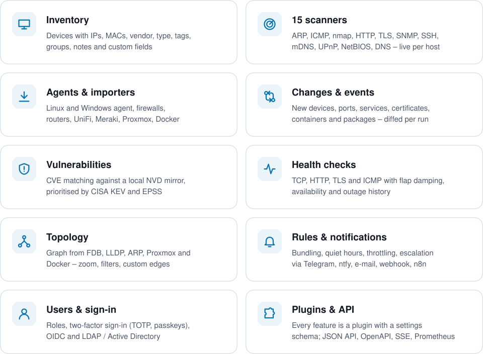
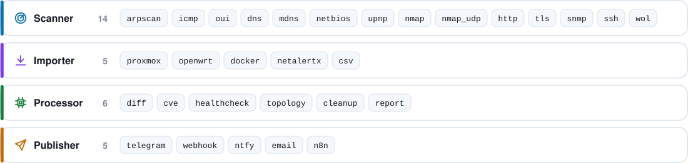
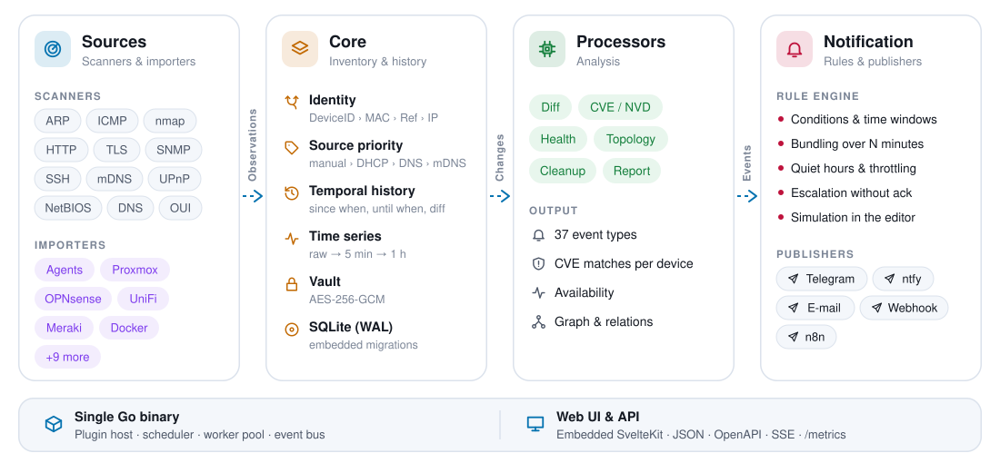

<p align="center">
  <picture>
    <source media="(prefers-color-scheme: dark)" srcset="docs/assets/banner-dark.svg">
    
  </picture>
</p>

<p align="center">
  <a href="#quick-start"></a>
  
  
  
  <a href="#plugins"></a>
  
</p>

<p align="center">
  <b>What is it, where is it, what runs on it, since when, what changed,<br>
  is it reachable, is it vulnerable?</b><br>
  NetScope answers this for every device on your network – self-hosted, as a single binary.
</p>

<p align="center">
  <b>English</b> · <a href="README.de.md">Deutsch</a>
</p>

## Features

<picture>
  <source media="(prefers-color-scheme: dark)" srcset="docs/assets/features-dark.svg">
  
</picture>

- **Inventory** of every device: addresses, vendor, type, tags, groups, custom fields, notes,
  parent/child links (host ↔ VM ↔ container, switch ↔ port) and a full change history.
- **Discovery** with ARP, ICMP, nmap (services, versions, OS), DNS, mDNS, NetBIOS, UPnP, HTTP,
  TLS, SNMP (including traffic per switch port) and SSH.
- **Imports** from Proxmox, OPNsense, pfSense, UniFi, MikroTik, FortiGate, Sophos, Meraki,
  FRITZ!Box, Pi-hole, OpenWrt, Docker, NetAlertX and CSV.
- **Agent for Linux and Windows:** inventory and utilisation without SSH access, also behind
  NAT; it updates itself.
- **Vulnerabilities:** CVE matching against a local NVD mirror, prioritised by CISA KEV and EPSS.
- **Monitoring:** change events, health checks, topology graph and reports.
- **Notifications:** rules with bundling, quiet hours, throttling and escalation via Telegram,
  ntfy, e-mail, webhook and n8n.
- **Remote networks and sites:** built-in WireGuard tunnels, or one NetScope instance per site
  reporting to a central one.
- **Users:** roles, two-factor sign-in (TOTP, passkeys), OIDC and LDAP / Active Directory.
- **English and German** interface, chosen per user.

## Quick start

NetScope runs as a container with host networking (ARP, mDNS, SSDP and Wake-on-LAN need direct
access to the LAN):

```yaml
# docker-compose.yml
services:
  netscope:
    image: netscope:latest
    build: .
    container_name: netscope
    network_mode: host
    cap_add: [NET_RAW, NET_ADMIN]
    volumes:
      - ./data:/data
    environment:
      TZ: Europe/Berlin
      NETSCOPE_LISTEN: ":8080"
    restart: unless-stopped
```

```bash
git clone <repo> netscope && cd netscope
make docker-up                      # builds the image and starts the container
cat data/admin-initial-password.txt # initial password of the user "admin"
```

Open `http://<host>:8080`, sign in and set your own password under **System → Password**. On
the first start NetScope adopts the directly attached networks as subnets; add more (routed
ones too) under **System → Subnets**.

> **Back up the master key.** Credentials are encrypted with `data/master.key`; without it,
> stored passwords and tokens are lost. It can also be passed as `NETSCOPE_MASTER_KEY`.

**Behind a reverse proxy** (Traefik, Caddy, nginx): NetScope speaks plain HTTP; enter the public
URL under **System → Settings**. If the proxy asks for a login (Pangolin, Authentik …), agents,
sites and Prometheus must bypass it – see the [guide](docs/GUIDE.md#hinter-einem-reverse-proxy-traefik).

Everything is configured in the web interface. A few bootstrap values (listen address, data
directory, time zone, log level, first admin password) come from `/data/config.yaml` or
environment variables – [full list](docs/GUIDE.md#konfiguration).

## Agents

Under **Agents → Install agent** NetScope creates a one-line install command:

```bash
# Linux, as root
curl -fsSL http://netscope.lan:8080/agent/install.sh | sudo sh -s -- --token nse_…
```

```powershell
# Windows, PowerShell as administrator
& ([scriptblock]::Create((irm 'http://netscope.lan:8080/agent/install.ps1'))) -Token nse_…
```

The agent runs without administrator rights, only reads and only connects out. Details in the
[guide](docs/GUIDE.md#netscope-agent).

## Plugins

<picture>
  <source media="(prefers-color-scheme: dark)" srcset="docs/assets/plugins-dark.svg">
  
</picture>

Every plugin is set up in the web interface: on/off, schedule, settings, scope (subnets,
groups, tags, devices, filter), timeout, retries and run history. Changes apply at once. The
[guide](docs/GUIDE.md#plugins) lists all plugins with their default schedules.

## How it works

<picture>
  <source media="(prefers-color-scheme: dark)" srcset="docs/assets/architecture-dark.svg">
  
</picture>

Scanners, importers and agents report what they see. The core assigns each report to a device,
keeps the history and derives changes; processors turn them into events, and the rule engine
decides who is notified. Details in [docs/ARCHITECTURE.md](docs/ARCHITECTURE.md).

## Documentation

The detailed documentation is in German.

| Document | Content |
|---|---|
| [docs/GUIDE.md](docs/GUIDE.md) | User guide: configuration, plugins, credentials, agents, WireGuard, multiple sites, filter language, rules, vulnerabilities, users and sign-in, languages, API, backup, security |
| [docs/ARCHITECTURE.md](docs/ARCHITECTURE.md) | Design, data model, plugin interfaces, event catalogue, API |
| [docs/PLUGINS.md](docs/PLUGINS.md) | Writing your own plugins |
| [docs/PUBLISHERS.md](docs/PUBLISHERS.md) | Telegram, ntfy, e-mail, webhook and n8n |
| [docs/FRONTEND.md](docs/FRONTEND.md) | Web interface: components, API client, conventions |
| [docs/FUTURE_REQUESTS.md](docs/FUTURE_REQUESTS.md) | Recorded feature requests |

The API is documented in the running instance at `/api/docs` (OpenAPI: `/api/openapi.json`).

## Development

| Command | Purpose |
|---|---|
| `make build` | Build the frontend and embed it in the binary (`bin/netscope`) |
| `make dev` | Go backend on :18080 and Vite dev server on :5173 with hot reload |
| `make test` | Unit tests, then the performance targets |
| `make lint` | gofmt, go vet, golangci-lint, Prettier, svelte-check |
| `make docker-up` / `docker-down` | Build and start / stop the container |
| `make smoke` | End-to-end test against a running instance |
| `make notices` | Regenerate `THIRD_PARTY_NOTICES.md` after dependency changes |

Without a local Go/Node toolchain, `make build/test/lint` run in Docker. The README graphics
are generated by `node scripts/readme-assets.mjs`.

## License

NetScope is proprietary software, © 2026 Clusterzx, all rights reserved – see
[LICENSE](LICENSE). Use requires a separate written license agreement.

Third-party components keep their own licenses ([THIRD_PARTY_NOTICES.md](THIRD_PARTY_NOTICES.md);
in the image under `/usr/share/doc/netscope/`). Note for distribution: the image contains
**nmap**, whose license (NPSL) requires an **Nmap OEM license** when nmap is distributed with a
proprietary product.
